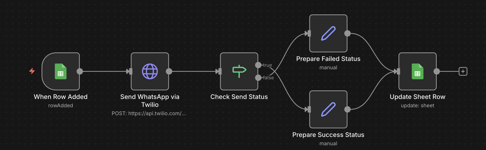
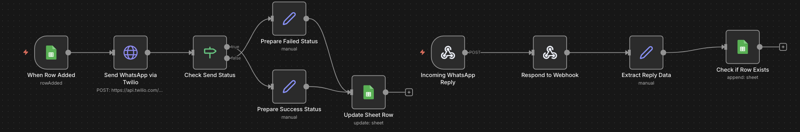

# 📲 Google Sheets ↔ WhatsApp Automation

Automate two-way WhatsApp communication using **Google Sheets**, **Twilio**, and **n8n**.  
This system transforms a spreadsheet into a **live WhatsApp messaging dashboard**.

---

## 🚀 Project Overview

This automation enables:

- 📤 Sending WhatsApp messages automatically when a new row is added in Google Sheets  
- 📥 Receiving WhatsApp replies and storing them back in the sheet  
- 🔄 Tracking message delivery status (Sent / Failed)  
- 🕒 Automatic timestamp logging  
- 🔎 Matching replies to users using phone numbers  

It works like a **mini WhatsApp CRM system** built with automation tools.

---

## ✨ Core Features

- Google Sheets → WhatsApp auto messaging  
- WhatsApp → Google Sheets reply tracking  
- Real-time message status updates  
- Timestamp logging  
- Phone-number based user matching  
- Built using **official Twilio WhatsApp API** (secure & scalable)  
- Two-way communication automation  

---

## 🛠 Tech Stack

| Tool | Purpose |
|------|---------|
| **Twilio WhatsApp API** | Sending & receiving WhatsApp messages |
| **n8n** | Workflow automation |
| **Google Sheets API** | Data storage and tracking |
| **HTTP Requests** | Twilio API communication |

---

## 🔄 System Workflow

### 📤 Outgoing Messages

Google Sheets (New Row)
↓
n8n Trigger
↓
Send WhatsApp Message (Twilio API)
↓
Check Send Status
↓
Update Google Sheet (Status + Timestamp)

### 📥 Incoming Messages

WhatsApp User Reply
↓
Twilio Webhook
↓
n8n Webhook Trigger
↓
Extract Reply Data
↓
Match Phone Number
↓
Update Google Sheet with Reply

---

## 🖼 Workflow Diagram

---

---

## 📄 Google Sheet Structure

| Column | Field Name    | Description |
|--------|--------------|-------------|
| A | Name | Recipient name |
| B | Phone_Number | WhatsApp number with country code |
| C | Message | Message to send |
| D | Status | Sent / Failed |
| E | Timestamp | Auto-filled send time |
| F | Reply_Message | User reply text |
| G | Reply_Time | Time of incoming message |

📌 Phone numbers **must include country code**  
Example: `+918050823618`

---

## ⚙️ Setup Guide

### 1️⃣ Twilio Setup

1. Create a Twilio account  
2. Activate **WhatsApp Sandbox** (for testing)  
3. Send:  
join <sandbox-code>

to:
+1 415 523 8886

4. Copy your:
- Account SID  
- Auth Token  

---

### 2️⃣ n8n Setup

1. Import the workflow JSON  
2. Add credentials:
- Google Sheets  
- Twilio (via HTTP Request Basic Auth)  
3. Activate the workflow  

---

### 3️⃣ WhatsApp Send Configuration

**HTTP Request Settings**

- Method: `POST`
- URL:
https://api.twilio.com/2010-04-01/Accounts/{ACCOUNT_SID}/Messages.json

**Body (Form URL Encoded):**

| Field | Value |
|------|------|
| From | `whatsapp:+14155238886` |
| To | `whatsapp:+91XXXXXXXXXX` |
| Body | Message text |

---

## 📥 Incoming WhatsApp Setup

- Configure Twilio Webhook → n8n Webhook URL  
- Extract from webhook:
  - Sender number  
  - Message body  
  - Timestamp  
- Update matching row in Google Sheet  

---

## 💰 Pricing Notes

- ❌ No lifetime free WhatsApp API  
- ✅ Twilio is **pay-as-you-go**  
- Charges are based on WhatsApp conversation pricing (Meta rates)  
- Suitable for production-grade systems  

---

## 📌 Best Practices

- Workflow triggers only on **new rows**, not edits  
- Always use phone numbers with country codes  
- Sandbox users must join once before messaging  
- For production, use **Twilio WhatsApp Business API**

---

## 👤 Author

**Nithin**  
Automation | Backend | WhatsApp Integrations  

---

## 📜 License

MIT License
